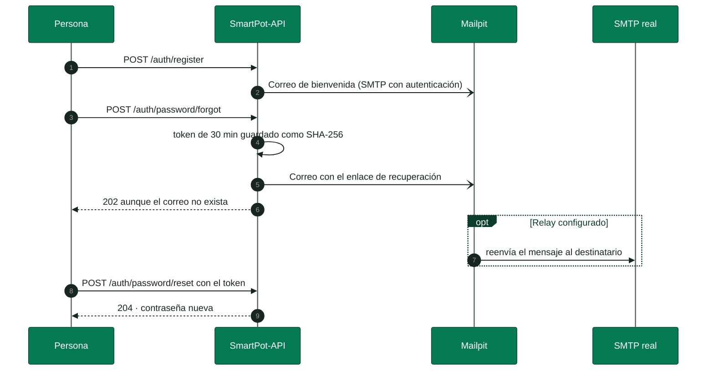

<!-- portada
eyebrow: Documentación del componente
titulo: SmartPot-Mail
acento: Mail
subtitulo: El correo de SmartPot
bajada: Mailpit con autenticación SMTP y de interfaz para los correos de bienvenida y recuperación de contraseña, con reenvío opcional a un proveedor real.
documento: SmartPot-Mail
version: 1.0 · septiembre 2026
equipo: SmartPotTech
proyecto: smartpot.app
-->

# SmartPot-Mail

## Ficha del documento

| Campo | Valor |
| --- | --- |
| Proyecto | SmartPot · [smartpot.app](https://smartpot.app) |
| Componente | [SmartPot-Mail](https://github.com/SmartPotTech/SmartPot-Mail) |
| Versión | 1.0 · septiembre 2026 |
| Alcance | Correos de la plataforma, protección de la bandeja, reenvío, configuración y pruebas |
| Documentación de la plataforma | [Documentación técnica](https://github.com/SmartPotTech/.github/blob/main/docs/SmartPot_Technical_Documentation.md), [recorrido del proyecto](https://github.com/SmartPotTech/.github/blob/main/docs/SmartPot_Project_Journey.md), [ciclo de vida](https://github.com/SmartPotTech/.github/blob/main/docs/SmartPot_Software_Lifecycle.md) y [diagramas generales](https://github.com/SmartPotTech/.github/blob/main/docs/README.md#diagramas-generales) |
| Mantenimiento | Se genera desde `docs/` de este repositorio con las herramientas de `.github/docs/tools`; se actualiza con cada cambio del componente |

## 1. Propósito

### En palabras simples

SmartPot envía dos correos: la bienvenida al crear la cuenta y el enlace para recuperar la contraseña. Mailpit los recibe, los guarda un tiempo y los muestra en una bandeja protegida; si se configura un proveedor, los reenvía para que lleguen a las personas. Los avisos de los cultivos no van por correo: van por la PWA y por Telegram.

## 2. Arquitectura del componente

```mermaid
%%{init: {"theme": "base", "fontFamily": "Segoe UI, Arial, sans-serif", "themeVariables": {"fontFamily": "Segoe UI, Arial, sans-serif", "fontSize": "15px", "primaryColor": "#DDF5EA", "primaryTextColor": "#17261F", "primaryBorderColor": "#067A52", "secondaryColor": "#E3F2FB", "secondaryTextColor": "#17261F", "secondaryBorderColor": "#1F6FA0", "tertiaryColor": "#F2F7F4", "tertiaryTextColor": "#17261F", "tertiaryBorderColor": "#D5E3DC", "lineColor": "#5B6B63", "textColor": "#17261F", "mainBkg": "#DDF5EA", "nodeBorder": "#067A52", "clusterBkg": "#F7FAF8", "clusterBorder": "#D5E3DC", "edgeLabelBackground": "#FFFFFF", "actorBkg": "#067A52", "actorBorder": "#0B3D2B", "actorTextColor": "#FFFFFF", "actorLineColor": "#5B6B63", "signalColor": "#17261F", "signalTextColor": "#17261F", "labelBoxBkgColor": "#0B3D2B", "labelBoxBorderColor": "#0B3D2B", "labelTextColor": "#FFFFFF", "loopTextColor": "#0B3D2B", "noteBkgColor": "#FDF4DD", "noteBorderColor": "#C98D12", "noteTextColor": "#17261F", "activationBkgColor": "#DDF5EA", "activationBorderColor": "#067A52", "attributeBackgroundColorOdd": "#FFFFFF", "attributeBackgroundColorEven": "#F2F7F4"}, "layout": "elk", "elk": {"nodePlacementStrategy": "BRANDES_KOEPF", "mergeEdges": false, "cycleBreakingStrategy": "GREEDY"}}}%%
flowchart LR
  api["SmartPot-API<br/>MailService"]
  admin(["Equipo de SmartPot"])
  subgraph imagen["Imagen smartpot-mail · Mailpit · usuario 1000"]
    direction TB
    smtp["SMTP :1025<br/>usuario y contraseña<br/>solo red interna"]
    ui["Interfaz y API :8025<br/>usuario y contraseña propios"]
    store[("Mensajes en /tmp<br/>30 días o 500 mensajes")]
  end
  nginx["nginx<br/>https://mail.smartpot.app"]
  relay["SMTP real opcional<br/>MP_SMTP_RELAY_*"]
  api -->|"bienvenida · recuperación"| smtp --> store
  admin --> nginx --> ui --> store
  smtp -.->|"reenvío si se configura"| relay
  classDef leaf fill:#DDF5EA,stroke:#067A52,color:#17261F
  classDef water fill:#E3F2FB,stroke:#1F6FA0,color:#17261F
  classDef sun fill:#FDF4DD,stroke:#C98D12,color:#17261F
  classDef clay fill:#FBE9E1,stroke:#B85A38,color:#17261F
  classDef core fill:#067A52,stroke:#0B3D2B,color:#FFFFFF
  classDef deep fill:#0B3D2B,stroke:#06281C,color:#FFFFFF
  classDef muted fill:#F2F7F4,stroke:#5B6B63,color:#17261F
  class api,relay water
  class admin core
  class smtp,ui leaf
  class store muted
  class nginx sun
```

<!-- diagrama: SmartPot_Mail_Global_Component | titulo=SmartPot-Mail por dentro -->

## 3. Flujo de los correos

<!-- diagrama: SmartPot_Mail_01_Mail_Flow | titulo=Bienvenida y recuperación de la contraseña -->

## 4. Seguridad

| Control | Detalle |
| --- | --- |
| SMTP | Exige usuario y contraseña; sin TLS solo porque el tráfico no sale de la red interna |
| Bandeja | `mail.smartpot.app` exige su propio usuario y contraseña |
| Credenciales | Llegan por variables de entorno; no se escriben en archivos ni en los logs |
| Contenedor | Usuario `1000`, solo lectura; mensajes en `/tmp` con vida limitada |

## 5. Configuración y pruebas

| Variable | Uso |
| --- | --- |
| `MAIL_USERNAME`, `MAIL_PASSWORD` | Cuenta SMTP que usa la API |
| `MAILPIT_UI_USERNAME`, `MAILPIT_UI_PASSWORD` | Acceso a la bandeja |
| `MP_MAX_MESSAGES`, `MP_MAX_AGE` | Cuántos mensajes y por cuánto tiempo se guardan |
| `MP_SMTP_RELAY_*` | Reenvío opcional a un proveedor real |

`sh tests/smoke.sh smartpot-mail:ci` comprueba que el SMTP y la interfaz rechacen accesos sin credenciales, que un correo autenticado se entregue y que los logs no muestren secretos. Cada cambio en `main` pasa por el CI, publica `ghcr.io/smartpottech/smartpot-mail` y pide el despliegue central de `.github`.
